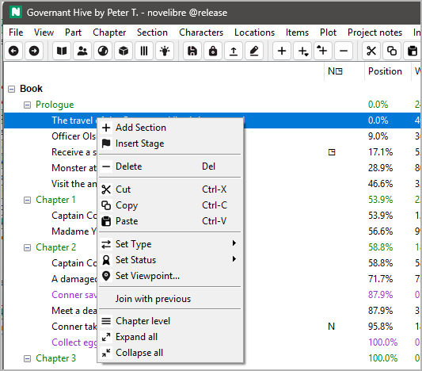

# nv_bw_icons

The [novelibre](https://github.com/peter88213/novelibre/) Python program helps authors organize novels.  

*nv_bw_icons* is a plugin providing a "black/white" icon set.

## Requirements

- [novelibre](https://github.com/peter88213/novelibre/) version 5.47+

## Download and install

### Default: Executable Python zip archive

Download the latest release [nv_bw_icons_v0.1.0.pyz](https://github.com/peter88213/nv_bw_icons/raw/main/dist/nv_bw_icons_v0.1.0.pyz)

- Launch *nv_bw_icons_v0.1.0.pyz* by double-clicking (Windows desktop),
- or execute `python nv_bw_icons_v0.1.0.pyz` (Windows), resp. `python3 nv_bw_icons_v0.1.0.pyz` (Linux) on the command line.

> [!IMPORTANT]
> Many web browsers recognize the download as an executable file and offer to open it immediately. 
> This starts the installation under Windows.
> 
> However, depending on your security settings, your browser may 
> initially  refuse  to download the executable file. 
> In this case, your confirmation or an additional action is required. 
> If this is not possible, you have the option of downloading 
> the zip file. 

### Alternative: Zip file

The package is also available in zip format: [nv_bw_icons_v0.1.0.zip](https://github.com/peter88213/nv_bw_icons/raw/main/dist/nv_bw_icons_v0.1.0.zip)

- Extract the *nv_bw_icons_v0.1.0* folder from the downloaded zipfile "nv_bw_icons_v0.1.0.zip".
- Move into this new folder and launch *setup.py* by double-clicking (Windows/Linux desktop), 
- or execute `python setup.py` (Windows), resp. `python3 setup.py` (Linux) on the command line.

---

[Changelog](docs/changelog.md)

## Usage

See the [online manual](docs/usage.md)

---

## Credits

- The *novelibre* logo is made using the free *Pusab* font by Ryoichi Tsunekawa, [Flat-it](http://flat-it.com/).
- The icons are based on the [Eva Icons](https://akveo.github.io/eva-icons/#/), published under the [MIT License](http://www.opensource.org/licenses/mit-license.php). The original black and white icons were colored for this application by the maintainer. 

----

## License

This is Open Source software, and the *nv_bw_icons* plugin is licensed under GPLv3. See the
[GNU General Public License website](https://www.gnu.org/licenses/gpl-3.0.en.html) for more
details, or consult the [LICENSE](https://github.com/peter88213/nv_bw_icons/blob/main/LICENSE) file.
